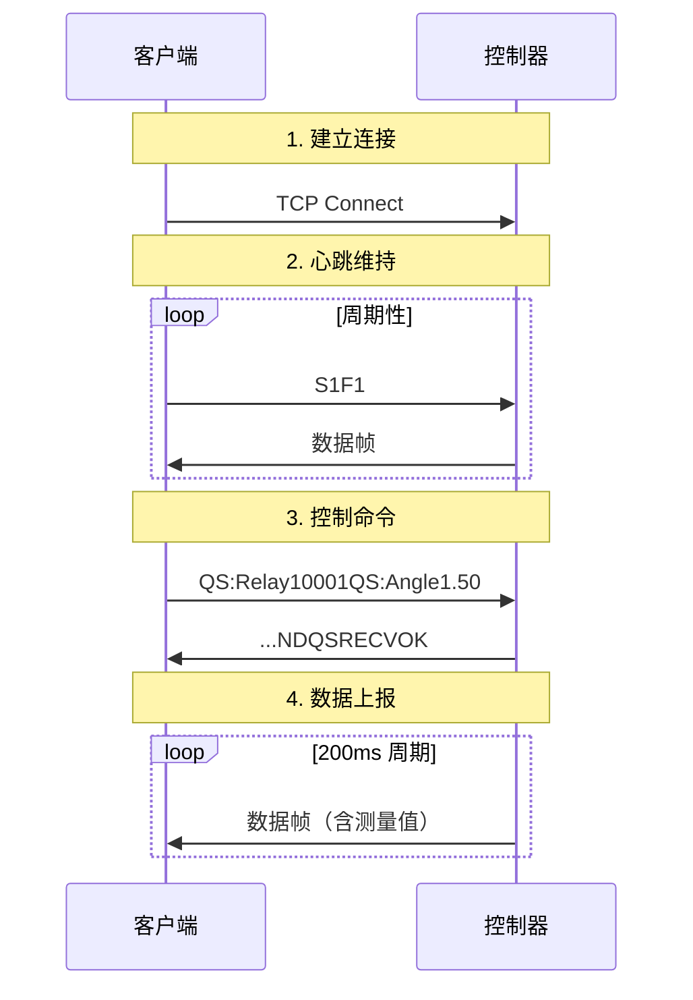

好的，创建 TCP 通信协议文档：

```markdown
# TCP 通信协议文档

本文档描述了四轮定位校准系统与控制器之间的 TCP 通信协议格式。

## 概述

- **通信方式**: TCP Socket
- **编码格式**: ASCII
- **默认端口**: 10001
- **数据流向**: 双向通信

---

## 一、发送格式（客户端 → 控制器）

### 1. 心跳命令

用于维持连接状态，周期性发送。

| 字段 | 格式 | 示例 |
|------|------|------|
| 心跳 | `S1F1` | `S1F1` |

### 2. 控制命令

#### 2.1 命令结构

```
{MODE}:Relay{RELAY_BITS}{COMMAND}
```

| 字段 | 说明 | 取值 |
|------|------|------|
| MODE | 工作模式 | `QS`（前束角）/ `WQ`（外倾角）|
| RELAY_BITS | 继电器位（二进制） | 见下表 |
| COMMAND | 具体命令 | 见命令类型 |

#### 2.2 继电器位（RELAY_BITS）

继电器位由二进制数表示，各位含义如下：

| 位 | 十进制值 | 含义 |
|----|----------|------|
| Bit 0 | 1 | FL（左前轮）选中 |
| Bit 1 | 2 | FR（右前轮）选中 |
| Bit 2 | 4 | RL（左后轮）选中 |
| Bit 3 | 8 | RR（右后轮）选中 |
| Bit 4 | 16 | QS 模式激活 |
| Bit 5 | 32 | WQ 模式激活 |

**计算公式**：
```typescript
let relayrc = 0;
if (wheels.FL) relayrc += 1;
if (wheels.FR) relayrc += 2;
if (wheels.RL) relayrc += 4;
if (wheels.RR) relayrc += 8;
if (mode === 'QS') relayrc += 16;
if (mode === 'WQ') relayrc += 32;
// 转为二进制字符串
const relayBinary = relayrc.toString(2);
```

#### 2.3 命令类型

| 命令类型 | 格式 | 说明 | 示例 |
|----------|------|------|------|
| 角度设定 | `{MODE}:Angle{VALUE}` | 设置目标角度 | `QS:Angle1.50` |
| 归零 | `{MODE}_ZERO` | 所有值归零 | `QS_ZERO` |
| 归位 | `{MODE}_HM` | 回到原点 | `WQ_HM` |

### 3. 完整命令示例

| 场景 | 命令 | 说明 |
|------|------|------|
| QS 模式设置 FL 轮角度 1.50° | `QS:Relay10001QS:Angle1.50` | relayrc=17 (1+16) |
| QS 模式设置所有前轮角度 2.00° | `QS:Relay10011QS:Angle2.00` | relayrc=19 (1+2+16) |
| WQ 模式归零 | `WQ:Relay100001WQ_ZERO` | relayrc=33 (1+32) |
| WQ 模式归位 | `WQ:Relay100001WQ_HM` | relayrc=33 (1+32) |

---

## 二、接收格式（控制器 → 客户端）

### 1. 数据帧结构

```
{PREFIX}ST_status{STATUS}qzq{V1}qyq{V2}qzh{V3}qyh{V4}wzq{V5}wyq{V6}wzh{V7}wyh{V8}ND{ACK}
```

### 2. 字段说明

| 字段 | 说明 | 取值范围 |
|------|------|----------|
| PREFIX | 固定前缀 | `,0,0,0,0 </2;0;0;1;0;33;0;0;0;32000;0;0;/> _` |
| ST_status | 状态码 | `0`=空闲，`1`=运动中 |
| qzq | 前束角-左前 | 浮点数，如 `1.50` |
| qyq | 前束角-右前 | 浮点数 |
| qzh | 前束角-左后 | 浮点数 |
| qyh | 前束角-右后 | 浮点数 |
| wzq | 外倾角-左前 | 浮点数 |
| wyq | 外倾角-右前 | 浮点数 |
| wzh | 外倾角-左后 | 浮点数 |
| wyh | 外倾角-右后 | 浮点数 |
| ND | 数据结束标记 | 固定值 |
| ACK | 确认标记（可选） | 见下表 |

### 3. 测量值字段映射

| 字段 | 模式 | 轮位 | 含义 |
|------|------|------|------|
| qzq | QS | FL | 前束角-左前 |
| qyq | QS | FR | 前束角-右前 |
| qzh | QS | RL | 前束角-左后 |
| qyh | QS | RR | 前束角-右后 |
| wzq | WQ | FL | 外倾角-左前 |
| wyq | WQ | FR | 外倾角-右前 |
| wzh | WQ | RL | 外倾角-左后 |
| wyh | WQ | RR | 外倾角-右后 |

### 4. ACK 确认标记

控制器在执行命令后会附加 ACK 标记：

| ACK 标记 | 触发条件 | 说明 |
|----------|----------|------|
| `QSRECVOK` | QS 模式角度设定完成 | 前束角角度命令确认 |
| `WQRECVOK` | WQ 模式角度设定完成 | 外倾角角度命令确认 |
| `QS_ZEROOK` | QS 模式归零完成 | 前束角归零确认 |
| `WQ_ZEROOK` | WQ 模式归零完成 | 外倾角归零确认 |
| `QS_HMOK` | QS 模式归位完成 | 前束角归位确认 |
| `WQ_HMOK` | WQ 模式归位完成 | 外倾角归位确认 |

### 5. 传感器状态

| 标记 | 说明 |
|------|------|
| `SensorOK` | 传感器正常 |
| `SensorNG` | 传感器异常 |

### 6. 接收数据示例

**正常数据帧**：
```
,0,0,0,0 </2;0;0;1;0;33;0;0;0;32000;0;0;/> _ST_status0qzq1.50qyq0.00qzh0.00qyh0.00wzq0.00wyq0.00wzh0.00wyh0.00ND
```

**带 ACK 的数据帧**：
```
,0,0,0,0 </2;0;0;1;0;33;0;0;0;32000;0;0;/> _ST_status0qzq1.50qyq0.00qzh0.00qyh0.00wzq0.00wyq0.00wzh0.00wyh0.00NDQSRECVOK
```

---

## 三、解析逻辑

### 1. 发送命令构建（TypeScript）

```typescript
export function buildCommand(
  mode: 'QS' | 'WQ',
  pls: string,
  selectedWheels: Record<'FL' | 'FR' | 'RL' | 'RR', boolean>
): string {
  const relayrc = computeRelayrc(mode, selectedWheels);
  const relayBinary = relayrc.toString(2);
  return `${mode}:Relay${relayBinary}${pls}`;
}
```

### 2. 接收数据解析（TypeScript）

```typescript
export function parseInboundData(raw: string): {
  sensorOk: boolean | null;
  statusrc: number | null;
  measurements: Partial<Measurements>;
  isAck: boolean;
} {
  const str = raw.replace(/\0/g, '').trim();
  
  // 状态码解析
  const statusMatch = str.match(/ST_status\s*([0-9]+)/i);
  const statusrc = statusMatch ? Number(statusMatch[1]) : null;
  
  // 测量值解析（通过 indexOf 定位各字段）
  const pos = {
    qzq: str.indexOf('qzq'),
    qyq: str.indexOf('qyq'),
    // ... 其他字段
  };
  
  // 提取各字段值
  measurements.qzq = str.slice(pos.qzq + 3, pos.qyq).trim();
  // ... 其他字段
  
  // ACK 检测
  const isAck = str.includes('QSRECVOK') || str.includes('WQRECVOK') || ...;
  
  return { sensorOk, statusrc, measurements, isAck };
}
```

---

## 四、通信流程



---

## 五、错误处理

| 场景 | 表现 | 处理建议 |
|------|------|----------|
| 连接断开 | TCP close 事件 | 重连或提示用户 |
| 传感器异常 | `SensorNG` 标记 | 显示警告，暂停操作 |
| 命令超时 | 未收到 ACK | 重发命令或提示失败 |
| 数据格式错误 | 解析失败 | 丢弃该帧，等待下一帧 |
```
